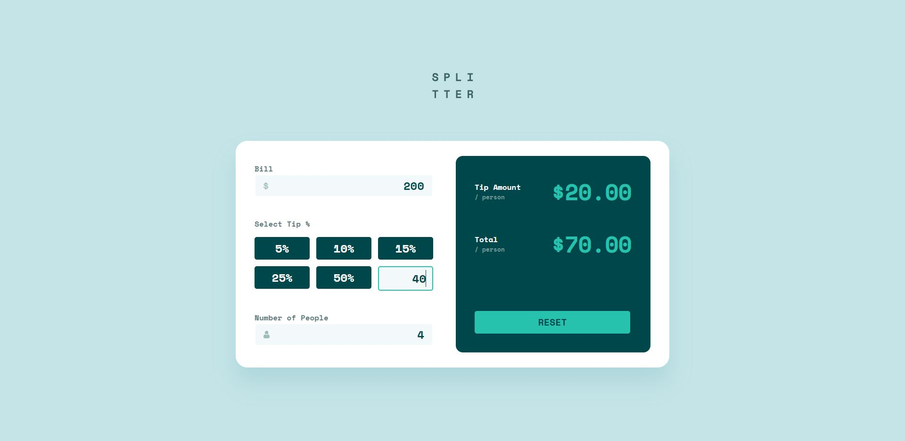

# Frontend Mentor - Tip calculator app solution

This is a solution to the [Tip calculator app challenge on Frontend Mentor](https://www.frontendmentor.io/challenges/tip-calculator-app-ugJNGbJUX). Frontend Mentor challenges help you improve your coding skills by building realistic projects.

## Table of contents

- [Overview](#overview)
  - [The challenge](#the-challenge)
  - [Screenshot](#screenshot)
  - [Links](#links)
- [My process](#my-process)
  - [Built with](#built-with)
  - [What I learned](#what-i-learned)
  - [Useful resources](#useful-resources)
- [Author](#author)

## Overview

### The challenge

Users should be able to:

- View the optimal layout for the app depending on their device's screen size
- See hover states for all interactive elements on the page
- Calculate the correct tip and total cost of the bill per person

### Screenshot

### Links

- Solution URL: [Code](https://github.com/rybaaa/Tip-Calculator)
- Live Site URL: [Demo](https://tip-calculator-rybak.vercel.app/)

## My process

### Built with

- [React](https://reactjs.org/) - JS library
- [Redux Toolkit](https://redux-toolkit.js.org/introduction/getting-started) - The official, opinionated, batteries-included toolset for efficient Redux development
- SCSS
- Flexbox
- Semantic HTML5 markup
- Module CSS

### What I learned

Use this section to recap over some of your major learnings while working through this project. Writing these out and providing code samples of areas you want to highlight is a great way to reinforce your own knowledge.

### Useful resources

- [Official documentation of Redux Toolkit](https://redux-toolkit.js.org/introduction/getting-started) - It helps you with managing store in applications and gives some recommendations hpw to use it correctly

## Author

- Website - [Portfolio](https://anton-rybak.netlify.app/)
- Frontend Mentor - [@rybaaa](https://www.frontendmentor.io/profile/rybaaa)
- Linkedin - [Anton Rybak](https://www.linkedin.com/in/anton-rybak-8babb6188/)
